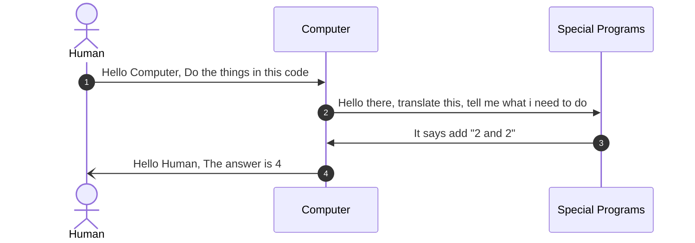

# Programming Languages: An Introduction and Classification

Before we delve into the classifications, we must firmly establish why we write
programs and the several available ways to do it

## A closer look at a computers

A lot of people like to conceive of computers as either laptops or desktops. Is
that all there is to it, though? Watch the video below, then when you're ready,
finish the remaining part of this  module.

<iframe width="100%" height="315" src="https://www.youtube.com/embed/rRSD128KWIM?si=q3jzMjQYlHnioC2R" title="YouTube video player" frameborder="0" allow="accelerometer; autoplay; clipboard-write; encrypted-media; gyroscope; picture-in-picture; web-share" referrerpolicy="strict-origin-when-cross-origin" allowfullscreen></iframe>

Computers are everywhere, and in almost in everything. 
Often times we hear Smart home, smart TV, Smart Ring, and many more. What makes them smart is the computer embedded in them.


And In reality, none is this device is smart; computers are like dumb machines
that excel at carrying out a very detailed instruction. These instructions give
computers the power they have, your smart watch, smart home, mobile phone and
many more they all run some kind of programs which enable them do the things they do.

## Beginning programming languages

As you may know or have heard, computer accepts and process instructions in binary, which is essentially a large sequence of zero's and one's 


Humans are incapable of writing complex instructions in binary and that's why
computer programming language came into the picture.

Computer programming language is an `English-like` construct which is easier to
write and learn and eventually, easier to instruct the computer with. As of
today, there are hundreds of programming languages, or a few thousand. Some of
the popular ones are Python, C++, Java, C, and COBOL, to mention a few.

Theoretically, they all do the same thing and they are all capable of doing the
same thing. I say theoretically because it is easier to use a programming
language in certain fields than others.

The instructions passed to a computer are called programs in a special file
called **source file**

> [!NOTE] 
> A source file is a special kind of file that contains a computer program

### How programs  work 
To complete the whole process of instructing a computer, the computer uses
special programs to translate the content of a source file passed to it, these
programs will be discussed later in this coursework, for the sake of brevity.
The Figure below shows the sequence of human instructing a computer



### Sample Program

Consider an implementation of the steps discussed above, implemented in a
Programming language called JavaScript

```javascript
// javascript codeblock

let result = 2 + 2;
console.log(`The result of 2+2 is ${result}`);
```

<<<<<<< HEAD

## Classification of programming language 
I mentioned the following concepts earlier, shall we do a quick recap before  we go on?
> [!IMPORTANT]
> 1. Computer understands binary, thus we have to instruct them in binary 
> 2. Human cannot efficiently codify instructions in binary, so we use computer programming language 
Remember? Ok good! 

Eventually our programs, or instructions contained in our source file will be acted upon by the computer. To do this, the computer uses special programs, one is called an **interpreter** and the other one is a **compiler**. As the name implies, interpreter translates the content of the source file to what the computer can understand, which is? ____ Yes! Binary is correct. This interpretation happens every time we want to perform the desired task. On the other hand the compiler interprets the programs once and create something called an **executable**, this executable is read every time the task is required

> [!NOTE]
> Interpreter translates every time the task is required to be completed 
>  Compiler translates once and create an executable file from the source file

Broadly, computer programming languages are classified based on the special programs the computer uses to decode the content of the source file 

> [!IMPORTANT]
> The content of a source file is called source code 

Summarily, programming languages are classified as:
1. Interpreted languages, eg JavaScript, Python, Ruby, Perl, etc
2. Compiled languages, eg. Rust, C++, C, Zig, Go, e.t.c

There are other forms of classification such as imperative languages, Object oriented languages, functional languages, and maybe more but I will restrict our reach to only interpreted and compiled language.

And with that we have come to the end of this module. There is a review page and a few quizzes up next. Good luck! 

