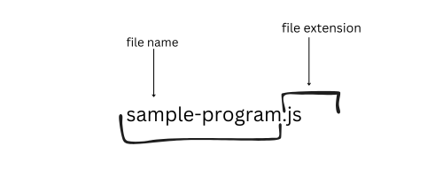

# Classification of programming languages.

Before we delve into the classifications, we must firmly establish why we write
programs and the several available ways to do it

## Beginning programming languages

As you may know or have heard, computer accepts and process instructions in
binary, which is essentially a large sequence of zero's and one's

 Humans are incapable of writing
complex instructions in binary due to a very high tendency of loss of attention
and inherent tendencies of multiple mistakes and that's why computer programming
language came into the picture.

Computer programming language uses an `English-like` construct which is easier
to write and learn and eventually, easier to instruct the computer with. As of
today, there are hundreds of programming languages, or a few thousand. Some of
the popular ones are Python, C++, Java, C, and COBOL, to mention a few.

## Source file

Generally, the raw form of instructions passed to a computer are contained in a
special file called **source file** The contents of a source file is called
**source code**. Some additional processes which would be discussed in
subsequent modules, is required to turn the source code into a useful program.
This processes would take the source files and convert them into the binary
format (**machine code**) required by the computer.

Ideally, these **special files** or source files are essentially text files,
with two parts, the file name, which can be anything, and certain file
extensions.

The source files of JavaScript, which is one of the programming languages we
shall study, has it source files ending with `.mjs` `.cjs` or `.js` extension,
other popular examples are `.py` for Python, `.go` for Golang, `.rs` for Rust,
`.cxx` for C++

## Classification of programming language

I mentioned the following concepts earlier, shall we do a quick recap before we
go on?

> [!IMPORTANT]

> Computer understands binary, thus we have to instruct them in binary; Also
> humans cannot efficiently codify instructions in binary, so we use computer
> programming language. Remember? Ok good!

Eventually the instructions contained in source files will need to be processed by the
computer. To do this, the computer uses special programs, such an
**interpreter** or a **compiler**.

As the name implies, interpreter translates the content of the source file to
what the computer can understand, which is? ____ Yes! Binary is correct. This
interpretation happens every time we want to perform the desired task. On the
other hand the compiler interprets the programs once and create something called
an **executable**, this executable is read every time the task is required

> [!NOTE]

> Interpreter translates every time the task is required to be completed
> Compiler translates once and create an executable file from the source file

Broadly, computer programming languages are classified based on the special
programs the computer uses to decode the content of the source file

Summarily, programming languages are classified as:

1. Interpreted languages, eg JavaScript, Python, Ruby, Perl, etc
2. Compiled languages, eg. Rust, C++, C, Zig, Go, e.t.c

There are other forms of classification such as imperative languages, Object
oriented languages, functional languages, and maybe more but I will restrict our
reach to only interpreted and compiled language.

And with that we have come to the end of this module. There is a review page and
a few quizzes up next. Good luck!
