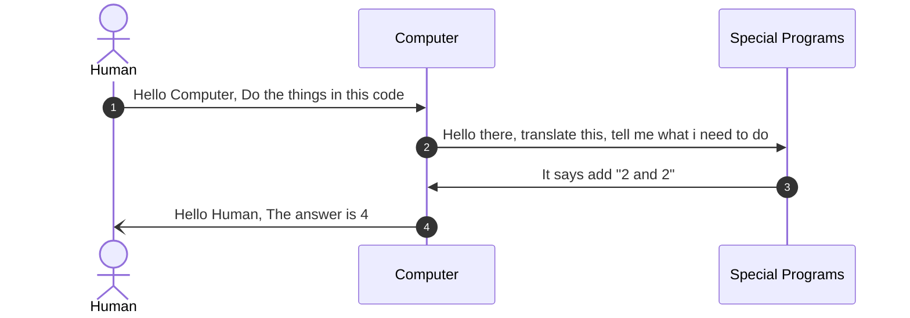

# Programming Languages: An Introduction and Classification

Before we delve into the classifications, we must firmly establish why we write
programs and the several available ways to do it

## A closer look at a computers

A lot of people like to conceive of computers as either laptops or desktops. Is
that all there is to it, though? Watch the video below, then when you're ready, read through the text below it. 

<iframe width="100%" height="315" src="https://www.youtube.com/embed/rRSD128KWIM?si=q3jzMjQYlHnioC2R" title="YouTube video player" frameborder="0" allow="accelerometer; autoplay; clipboard-write; encrypted-media; gyroscope; picture-in-picture; web-share" referrerpolicy="strict-origin-when-cross-origin" allowfullscreen></iframe>

Computers are everywhere, and in almost in everything. 
Often times we hear Smart home, smart TV, Smart Ring, and many more. What makes them smart is the computer embedded in them.


And In reality, none is this device is smart; computers are like dumb machines
that excel at carrying out a very detailed instruction. These instructions give
computers the power they have, your smart watch, smart home, mobile phone and
many more.

## Beginning programming languages

As you may know or have heard, computer operates on binary, which is essentially
0 and 1.

Humans are incapable of writing complex instructions in binary and that's why
computer programming language came into the picture.

Computer programming language is an `English-like` construct which is easier to
write and learn and eventually, easier to instruct the computer with. As of
today, there are hundreds of programming languages, or a few thousand. Some of
the popular ones are Python, C++, Java, C, and COBOL, to mention a few.

Theoretically, they all do the same thing and they are all capable of doing the
same thing. I say theoretically because it is easier to use a programming
language in certain fields than others.

Generally, the instructions passed to a computer are contained in a special file
called **source file** The contents of a source file is called **source code**

> [!NOTE] 
> A source file is a special kind of file that contains a computer program


Ideally, these "special files" or source files are essentially text files, with certain file extensions. A JavaScript source file would typically have a `.mjs` `.cjs` or `.js` extension. 

> [!TIP] 
> To understand a file extension, consider, images usually end in `.png` or `jpg` or `jpeg`, for audio files we have `.mp3` or `.avi` , these jpg, mp3, etc are called file extension 


To complete the whole process of instructing a computer, the computer uses
special programs to translate the content of a source file passed to it, these
programs will be discussed later in this coursework, for the sake of brevity, we'll just introduce them as `compilers` and `interpreters` 

### Sample program 

The Figure below shows the sequence of human instructing a computer to add two numbers, there's nothing fancy here 




Consider an implementation of the steps discussed above, implemented in a
Programming language called JavaScript

```javascript
// javascript codeblock

let result = 2 + 2;
console.log(`The result of 2+2 is ${result}`);
```

