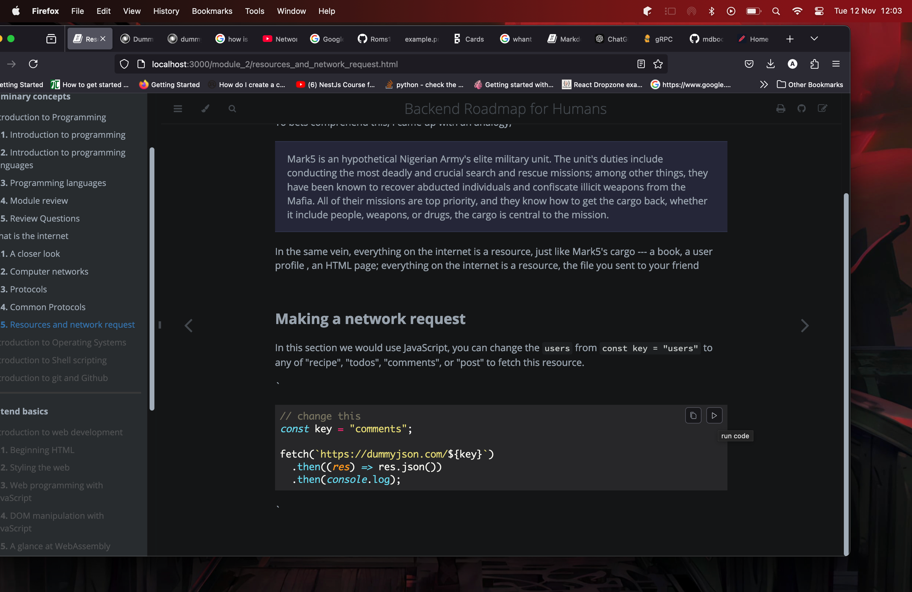

# Resources and network request

## Resource

To best comprehend what a resource is, consider the following analogy,

> Marks-5 is an hypothetical elite special forces unit in the Nigerian Army. The
> unit's duties include conducting the most deadly and crucial search and rescue
> missions; among other things, they have been known to recover abducted
> individuals and confiscate illicit weapons from the Mafia. All of their
> missions are top priority, and they know how to get the cargo back, whether it
> includes people, weapons, or drugs, the cargo is central to the mission.

In the same vein, everything on the internet is a resource, just like Marks-5's
cargo --- a music on Spotify, the file you sent to your friend on WhatsAPP, your
user profile on Facebook, an HTML page, a Google search result; everything on
the internet is a resource.

## Making a network request

In this section we would use JavaScript programming language to make a network
request.

You can change `users` in `const key = "users"` to either `recipe`, `todos`,
`comments`, or `post` to fetch that specific resource.

To make this request, click on the play icon at the top right corner of the code
snippet.



```javascript
const key = "comments"; // change this line

fetch(`https://dummyjson.com/${key}?limit=2`)
  .then((res) => res.json())
  .then(console.log);
```

The above response may not seem typical but don't fret, the most important
lesson here is that you made a request to a resource and you received a
successful response. Congratulations! 🎉
