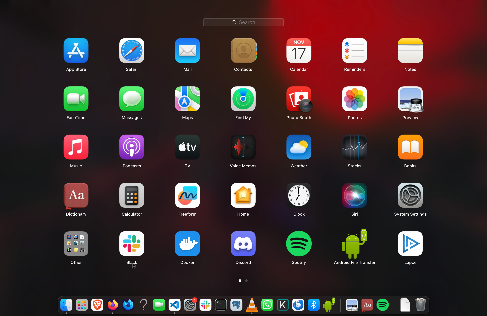

# Meeting the House keeper

On an average computer, there are several software packages, by this, I mean
likes of Apple store, Safari, Slack, Spotify, etc as seen in the picture. This
packages cannot just work out of the box, they cannot be downloaded or used
without the Operating system. The Operating system make all the awesomeness come
to live. There's a lot more technical detail to this, which I'll skip for
brevity sake.

The operating system is the most important software a software a computer runs,
it manages the computer hardware, software, memory and processes[^os] You can't
see it like every other software package that you use, but it lives there,
working beneath them all. The operating system belongs to a category of software
called **System software**, the other category is **Application software**.
Other examples of system softwares are Compilers and interpreters[^compilers]
which was introduced in module one

The application software are the myriads of tools we use everyday, like Internet
browser, word processors, image viewer.

[^os]: <https://edu.gcfglobal.org/en/computerbasics/understanding-operating-systems/1/>
[^compilers]: <https://www.quora.com/Why-do-some-people-consider-compiler-to-be-a-system-software>
