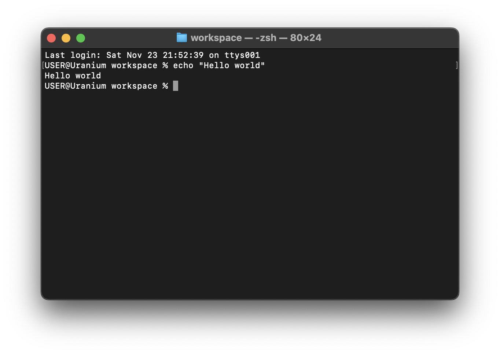
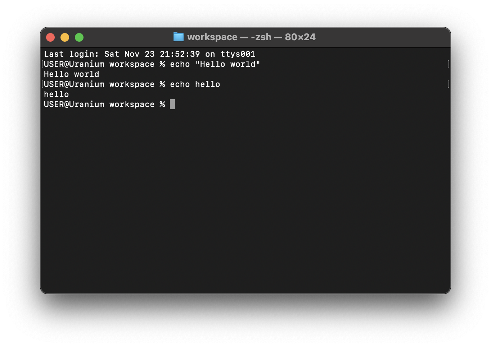

# echo

The `echo` command is used to print text in your terminal.

<!-- cmdrun echo "Hello, World" -->

Note that the string to be printed here is "Hello world".

If it is a single world, like `hello`, you can safely ignore the quotation marks.

<!-- cmdrun echo hello -->

