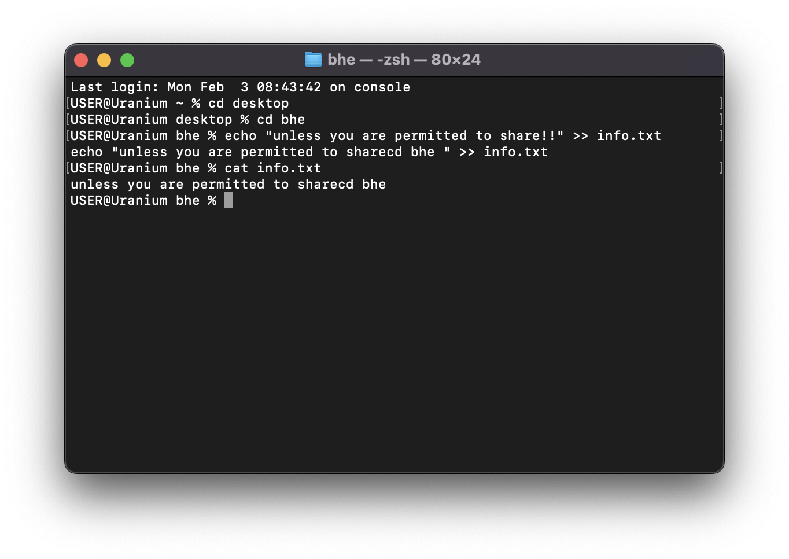

# Inspecting the content of a file

In the [previous lesson](./writing-content-to-file.md), we learnt about writing
content to a file, what if we can to see the content? we use the `cat` command.

The `cat` command takes the file path as an argument, this

```sh
cat info.txt
```


