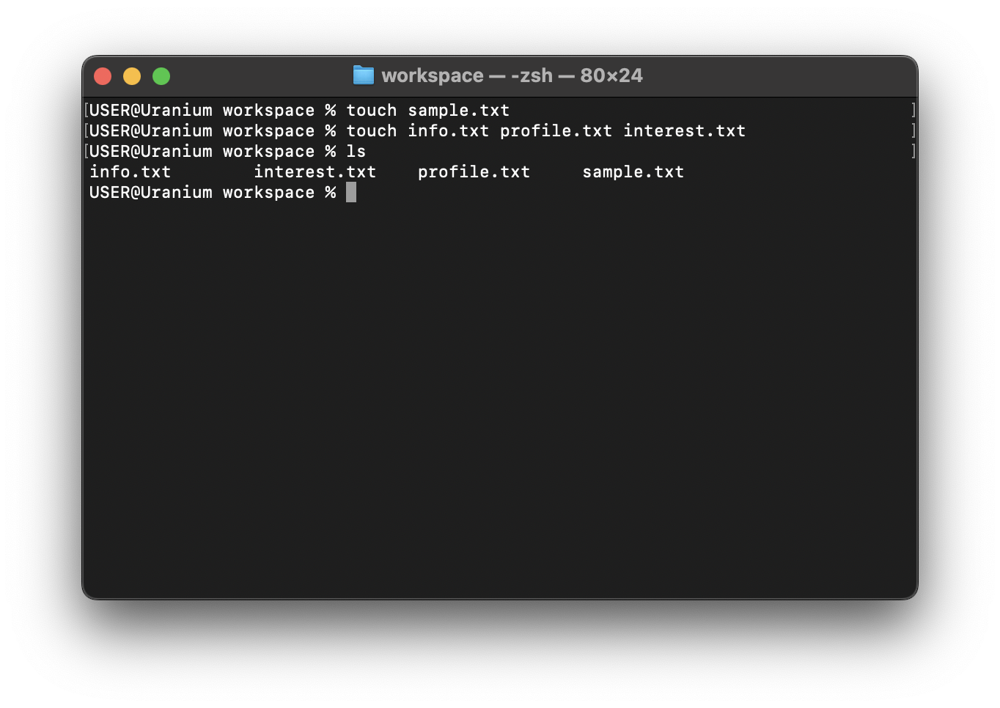

# ls

The ls command stands for list and is used to list the content of a directory.

In the previous module we created four files `sample.txt, info.txt profile.txt interest.txt`. The ls command let's us see these files.

```sh
ls
```


