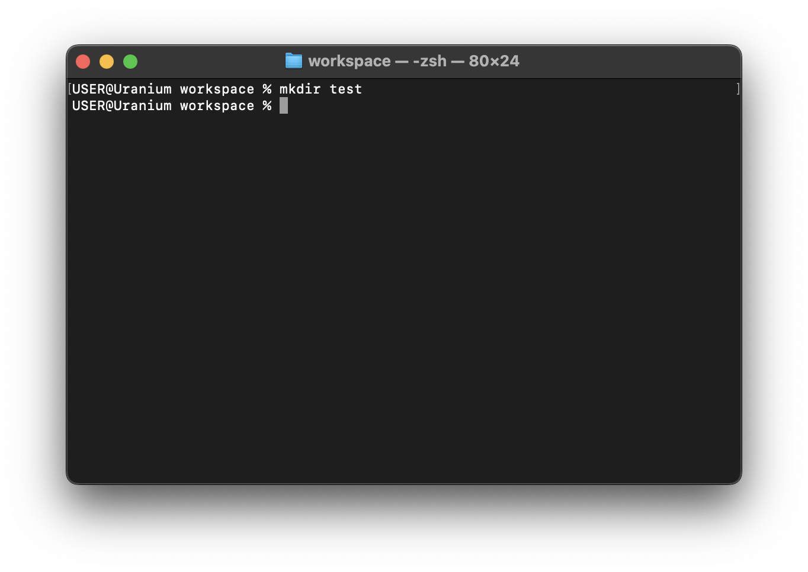
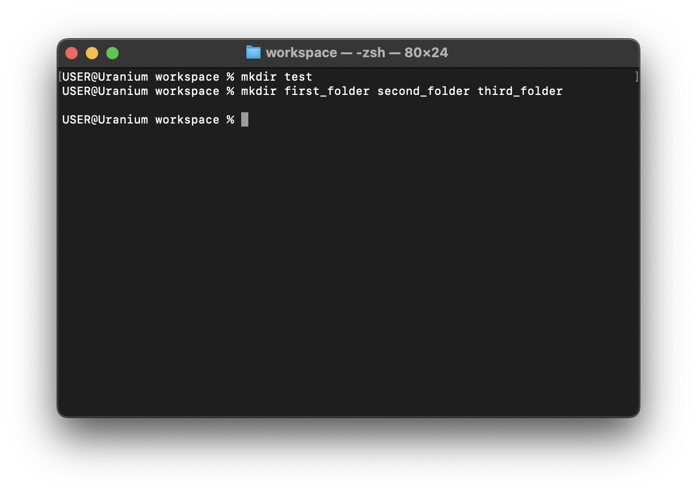

# mkdir

So far we have learnt how to work with work files, `mkdir` allow you to create
folder, like [touch command](./touch.md), you can pass one or more folders

```sh
mkdir test
```



```sh
mkdir first_folder second_folder third_folder
```



for the fun part, you can use the `ls` command to see the content of the file
