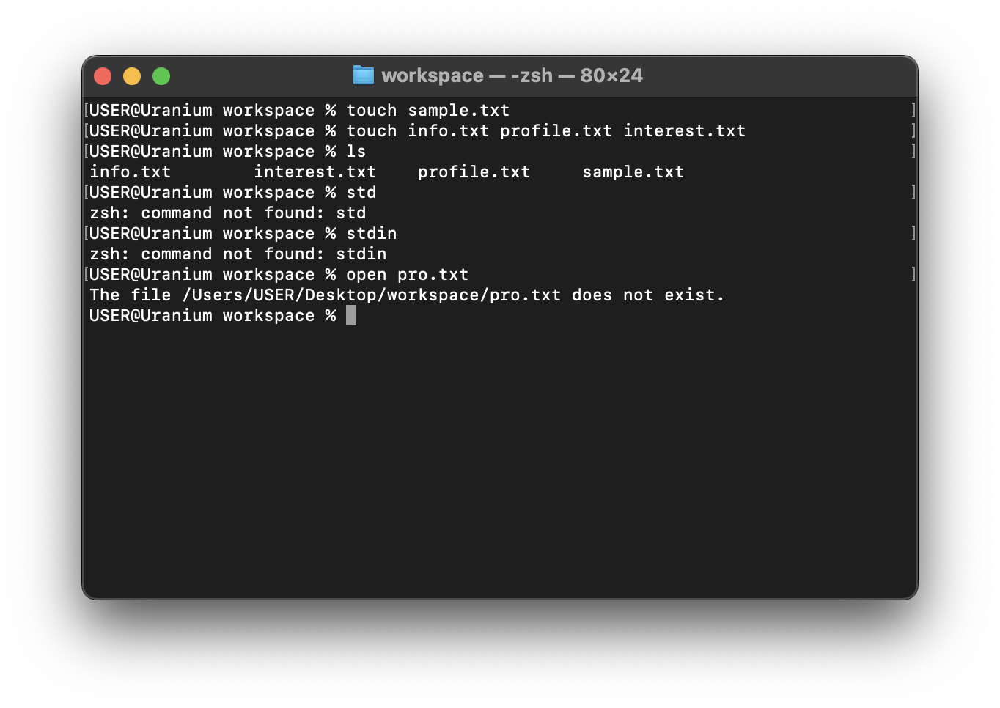

# stdin, stdout, stderr

Computers use streams to accept input, return output, or inform its user when an error occur. These streams are `stdin`, `stdout` and `stderr` respectively.

Contrary to what we have learnt in this module, especially about commands, `stdin`, `stdout` and `stderr` are not commands.

**stdin** stands for standard input, which is the default input device a program uses to read data. It is commonly used to read keyboard input, but it can also be a file or other input devices.

The terminal we have been using so far is a very good example of stdin, we can pass keyboard input to the computer, just by typing in the terminal.

**stdout** stands for standard output and refers to the default output stream in a computer program. It is the channel through which a program displays its output to the user or another program. When you run a program and it produces some output, such as text or numbers, that output is typically sent to the stdout stream.

The terminal we have been interacting with is also an stdout medium. Put simply, we are able to pass input (stdin) and get output (stdout).

**stderr** stands for standard error - this connotes when an error is returned. For instance, you get an error when you are trying to open a file that does not exist.

