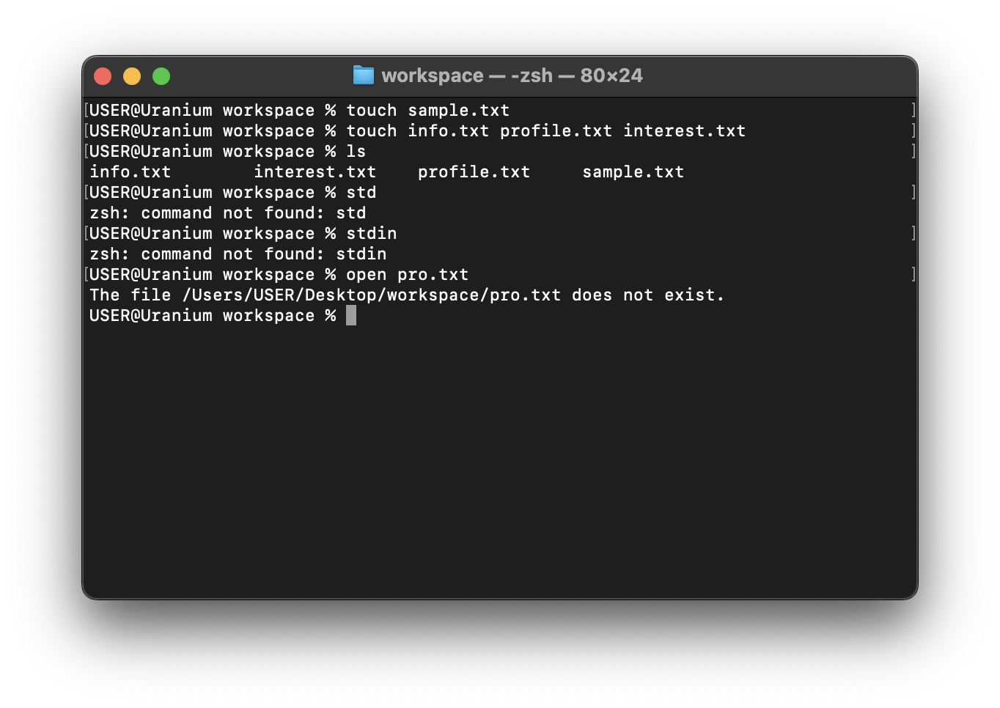

# stdin, stdout, stderr

Computers use three built-in channels — called **streams** — to handle input, output, and errors. These are `stdin`, `stdout`, and `stderr`. They are not commands; they are concepts that describe how data flows in and out of a program.

Think of it like a conversation:
- You speak → that's **input**
- The other person replies → that's **output**
- They tell you something went wrong → that's an **error**

**stdin** (standard input) is how a program receives data. Most often, this is your keyboard — when you type in the terminal, that text is sent to the program as stdin.

**stdout** (standard output) is how a program sends its results back to you. When a command prints something to the terminal (like `echo` printing a word), that output is stdout.

**stderr** (standard error) is a separate channel used exclusively for error messages. For example, if you try to open a file that does not exist, the error message you see is sent through stderr — not stdout.

