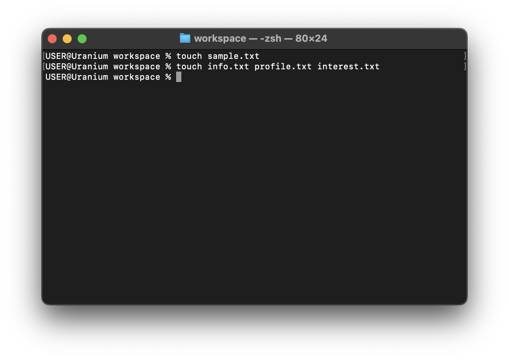

# touch

The touch command is used to create files, to create files in the current
folder, provide the name and path of the file. Let's create a `sample.txt`.

```sh
touch sample.txt
```


To create multiple files, add space between the commands

```sh
touch info.txt profile.txt interest.txt
```


