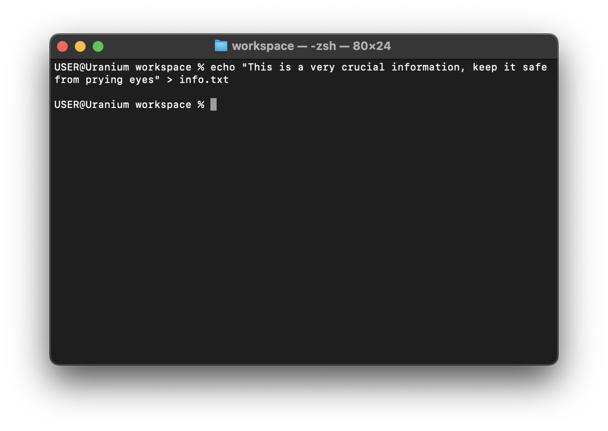

# Writing content to file

We learnt about [creating files](./touch.md), but these are just empty files.
Let's go on to add content to this file.

The [echo](./echo.md) command we learnt earlier can be used to write content to
a file.

Typically, the text passed to the echo commands, other wise known as the
`argument` gets printed to the [stdout](./std.md), however we can "pipe" this to
a file

```sh
echo "This is a very crucial information, keep it safe from prying eyes" > info.txt
```



If the file does not exist when you pipe the content of stdout or stderr to a
file, the file would be created, and the content would be added.
