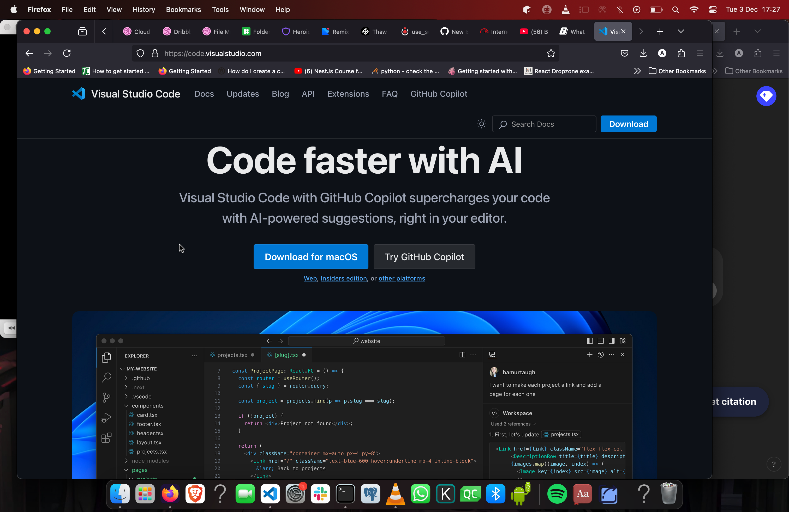

# VS code

VS code is a cross-platform (it works on all major operating systems) text
editor. It support customization and can be used for a various programming
languages. Proceed to
[https://code.visualstudio.com/](https://code.visualstudio.com/) to download the
software.

