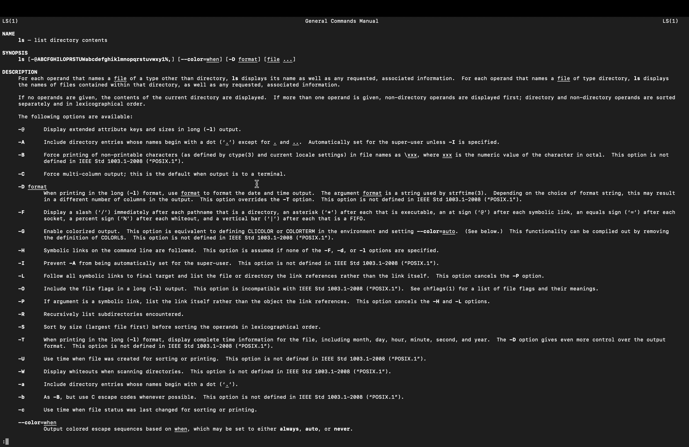

# What is a Shell?

Shell is a special user program that provides an interface to the user to use
operating system services. Operating systems include opening a file, deleting a
file, opening a program, renaming a file, etc.

Essentially the Shell accepts human-readable commands from input sources such as
keyboard-entry or file(shell scripts) and pass this to the Kernel

Put simple, the Shell is a special kind of kind of software that let you do some
tasks from the command line interface (CLI). A CLI would typically look like the
image below

Our focus on this module is focused on working with the Shell. Although, the
concept of Shell is typical to Linux and Mac operating systems otherwise known
as Unix-based operating systems. The Window operating system provides `cmd.exe`
and `powershell` as equivalents of the Unix-based system Shells.

For uniformity, we will only be interacting with the Unix-like shells here. This
can be accessed using
[Windows Subsystem for Linux (WSL)](https://learn.microsoft.com/en-us/windows/wsl/install)
or [git Bash](https://git-scm.com/downloads) which is automatically installed
with the installation of [git](https://git-scm.com/downloads).

Configuring WSL might be tricky especially without prior experience with the
CLI, so we will be using git Bash for this module

The next section will guide you through the installation of git and git bash for
Windows operating system users
