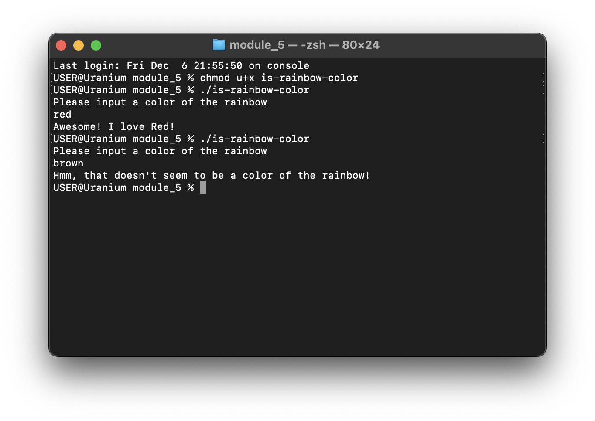
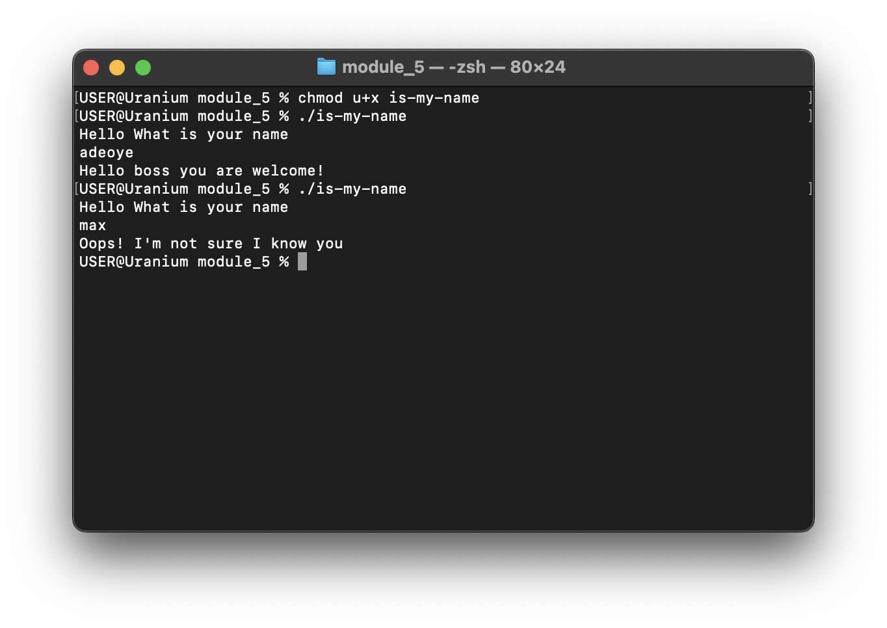

# Conditional evaluation

Like variables, conditional evaluation is on of the key things you'll see in
programming. It's based on which action to execute based on the matched
condition.

Bash gives you four keywords `if`, `elif`, `else` and `fi`

1. Conditional evaluation must start with an `if` and end with an `fi`
2. The conditional evaluation can contain zero or more `elif`
3. The base case, or the fallback must be handled by an `else`

Consider this example, we will read the input from the user and check if it a
color of the rainbow

```sh
{{#include ../../code-samples/module_5/is-rainbow-color}}
```



Consider Another example

If my name is "adeoye", print, "Hello boss you are welcome!", if not, print,
"oops! I'm not sure I know you"

```sh
{{#include ../../code-samples/module_5/is-my-name}}
```


