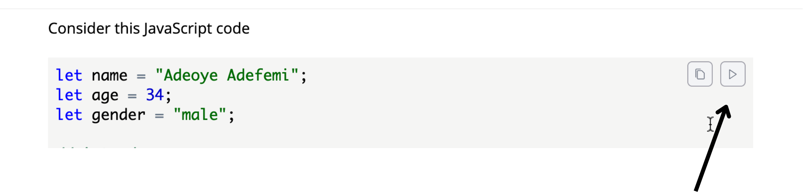

# Using Variable

Variables are not only typical to Shell scripting, we'll see them a lot in the
modules to come. They are like special containers for holding values. The values
they hold can be just about anything you as the programmer can think of and they
are identified by the name we give them.

Variable allow us to easily mutate (change, update ) a value. Before going on to
dealing with variables in Shell scripting, it would suffice to examine how
variables are named, and how they work

## A closer look at variables

Consider this JavaScript code

```js
{{#include ../../code-samples/module_5/introduction_to_variables.js}}
```

<div style="margin: 5rem 0">
To be candid, for someone that has not written any code, there is a lot of things going on here, and I can almost guess that you just scrolled past it! Now, go back, it doesn't make any or much sense but just read/observe all the lines.

When you are done, I encourage you to click on the arrow at the top right corner
to see the code in action.



The code run yields:

```sh
My name is Adeoye Adefemi, I am a 34 years old male. 
My name is Opeeolluwa, I am a 45 years old male. 
My name is Adeoye Adefemi Opeoluwa, I am a 60 years old male.
```

The key take away here is that, the terms `age`, `name`, and `gender` made it
possible to quickly update the values and to use them in multiple places. I
encourage you to edit the code, use your name in place of mine, then run the
code again.

These three things; `age`, `gender` and `name` as used here are called
variables.

At first age was "storing" the value **34**, then I updated this value to
**45**, and finally **60**

</div>

## Naming Variables

As a rule in many programming languages, or toolchain like the Shell scripting
we are studying, it is often encouraged that:

1. A variable should be descriptive,
2. A variable should start with a letter followed by a letter, more alphabets,
   or underscore.

Here are a few examples

```
my_name = "Adeoye"
my_country = "nigeria"
title_of_a_king = "King Jaja of Opobo"
```

The first one, talks about my name, it's very descriptive, the next is my
country, note that the variable `my_country` is very descriptive, and the same
can be said about the last example

With out of the way, let's address variable naming convection.

## Variable naming convection

As of today, there are 5 convectional methods of naming variables, they are as
follows

1. snake case
2. upper snake case
3. camel case
4. pascal case
5. kebab case

### Snake case

In snake case, you separate your variables with underscore. For example,
`my_name`, `my_friends_name`

### Upper snake case

Like the snake case, you separate your variables with underscore, however these
words must be capitalized. For example `MY_NAME`, `MY_FRIENDS_NAME`. This is
often used for variables that would not change, otherwise knows as constants.

### Camel case

In camel case, you capitalize the first letter of every word, except the first,
this gives `myName` , `myFriendsName`.

### Pascal case

Very similar to camel case, just that you capitalize the first letter of each
word, this gives. `MyName`, `MyFriendsName`.

### Kebab case

The kebab case is very similar to the snake case, just that hyphens are used in
place of underscores. For example, we have `my-name`, `my-friends-name`

## Variables in shell scripting

Finally, here we are, variables in Shell scripting, consider a minimal
reproduction of the JavaScript code. I'll create a file, `var` and add the
following content.

```bash
{{#include ../../code-samples/module_5/shell-variables}}
```

On line <span class="line-number"> 3</span> and <span class="line-number">
4</span>. We declared, the variables `name` and `age`. Then on line
<span class="line-number"> 6</span> and <span class="line-number"> 7 </span> We
print this values, using the [echo](../../module_4/commands/echo.md) command we
have previously discussed.

Go on to make this executable and run it.

```sh
chmod u+x var
./var
```

Suffice to say that, when we want to use these values, we had to prepend the
variables with dollar sign `$` this is a very important thing.

Your output should be similar to this

```sh
adeoye
4
```
