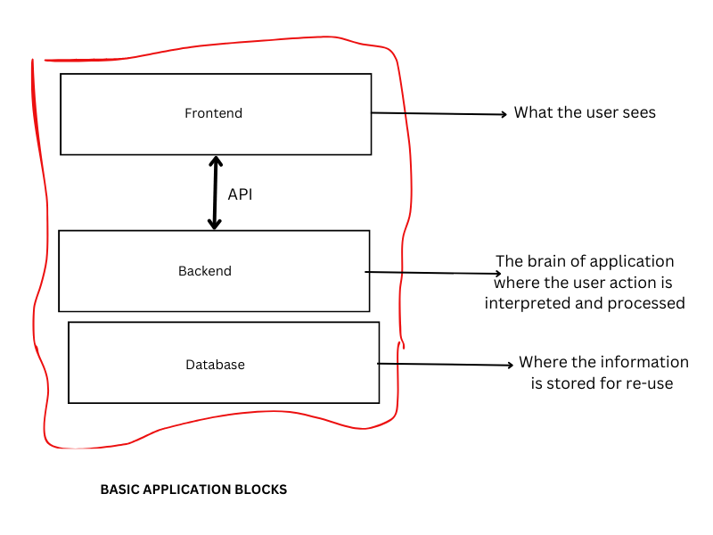

# Introduction backend development

This coursework is focused on building "backend" applications. We'll start by to explaining what that means and a very popular analogy is the restaurant analogy.

Imagine a modern restaurant, there's the customer sitting area, the waiter or waitress, and a kitchen. Often, the kitchen would have some kind of back-office or a store where things are kept.

In a similar fashion, an application or a piece of software is composed of three major layers; the presentation layer (frontend), the business logic layer (backend), and the persistence layer (database).

The presentation layer is formally known as the **frontend**. This can be a mobile application, a web application, a desktop application or even a Command Line application. The purpose of the frontend is to abstract away the wiring of the system and make it cognitive and understandable for end-users.

The **backend** is where all the heavy lifting happens; where the user's request are understood, validated, and processed. Usually the backend would need to interact with some kind of stored data.

Between the backend and the frontend we have the **Application Programming Interfaces** (APIs) which serves as the pipeline connecting the application core (backend) to what the users see -- the frontend.

As a backend engineer, your duties would be to build the application core using any programming language you are most convenient with or with the one your team uses or the one your team lead specifies. Part of yor job is also deciding how the frontend would consume the available data.

With this, we have come to the end of the preliminary concepts. In the next section, we will focus on programming, from choosing a programming language to doing some tasks and petty projects.
